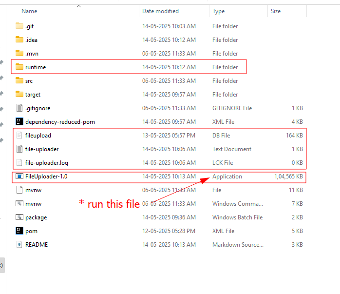
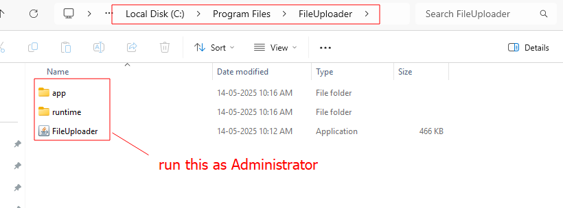
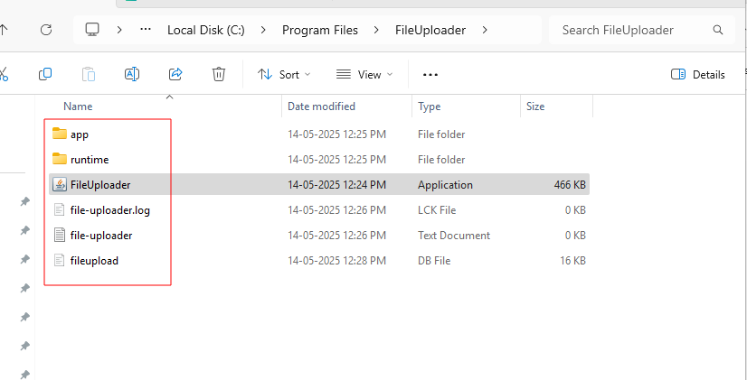

Requirement of the Application installer
---------------------------------------------------------------------------
**1. App Installation & Activation**
Create a Windows desktop installer using JavaFX. Include an optional activation screen where the user enters an activation code to unlock the application. Handle secure local storage of activation state.

**2. Home Screen & Manual Backup**
Develop a user-friendly home screen that displays last backup time, allows manual backup triggering, shows list of successfully uploaded files, and offers quick access to settings.

**3. Automated Backup & Cloud Integration**
Implement a background service to collect data automatically from local machines, encrypt using 256-bit AES encryption, and securely upload to AWS S3 or Azure Blob. Include file transfer retry logic for reliability. Separate storage by remote office location.

**4. Cloud Service Integration (Serverless API)**
Build lightweight serverless APIs using AWS Lambda or Azure Functions for tasks such as file metadata tracking, connectivity testing, and cloud interaction. Helps support automation without full backend setup.

Steps For Creating installer .exe file
----------------------------------------------------------------------------
**for running the Application**
1. run the **mvn clean install** to create .jar file on the terminal
2. run the **mvn clean package** on the terminal
3. run the main application fileUpload or just run the **mvn javafx:run** after teh --> mvn clean package
4. right to the .bat file and run it to create an .exe file
5. right on the .exe file run as Administrator
6. install it (if you want than restart the PC otherwise it fine)
7. short cut will get created on the desktop double click on it
8. ready to go upload your file on the s3 bucket

**for check the database logs**
1. sqlite3 fileupload.db -> SELECT * FROM upload_logs ORDER BY timestamp ASC;
2. if you get any Error please check the try out sqlite3 -> .tables  # To see all tables
3. and also sqlite3 -> SELECT * FROM upload_logs;  # To see all records
4. to Empty database --> DELETE FROM upload_logs;

output like
----------------------------------------------------
**To Create install (fileUploader.exe)**
1. run the **mvn clean install** to create .jar file on the terminal
2. run the **mvn clean package** on the terminal
3. right to the .bat file and run it. (you getting following output on the terminal)

```
cmd.exe /c package.bat
Creating custom runtime...
Creating installer...
Installer created successfully in D:\Workspace\POCs\javaFX\FileUploader\
Press any key to continue . . .
```

4. double click on the installer file it will start downloading when it finish you see the shortcut on the desktop double click on that


5. when you install that file you will get the related file created in the C/program file/fileUploader/
